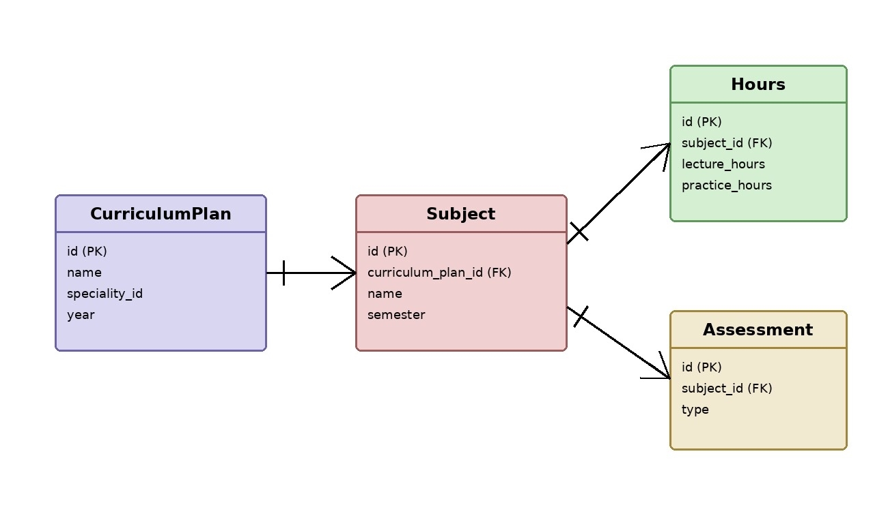

### Вариант №12. Сервис учебного плана (Curriculum Plan)

#### Создание учебного плана

Информация требуемая для создания учебного плана

| Параметр | Обязательность | Тип | Ограничение | Значение по умолчанию |
|----------|----------------|-----|-------------|-----------------------|
| name | Обязательно | Строка | Не пустое | — |
| speciality_id | Обязательно | Целое | Существует в сервисе 6 | — |
| year | Обязательно | Целое | > 2000 | — |

Выходные данные

| Параметр | Тип |
|----------|-----|
| id | Целое |
| name | Строка |
| speciality_id | Целое |
| year | Целое |

---

#### Получение учебного плана по ID

Входные параметры

| Параметр | Обязательность | Тип | Ограничение | Значение по умолчанию |
|----------|----------------|-----|-------------|-----------------------|
| id | Обязательно | Целое | Существует в БД | — |

Выходные данные

| Параметр | Тип |
|----------|-----|
| id | Целое |
| name | Строка |
| speciality_id | Целое |
| year | Целое |

---

#### Получение списка учебных планов

Входные параметры

| Параметр | Обязательность | Тип | Ограничение | Значение по умолчанию |
|----------|----------------|-----|-------------|-----------------------|
| year | Необязательно | Целое | > 2000 | — |
| speciality_id | Необязательно | Целое | — | — |

Выходные данные

| Параметр | Тип |
|----------|-----|
| plans | Список |

---

#### Обновление учебного плана

Входные параметры

| Параметр | Обязательность | Тип | Ограничение | Значение по умолчанию |
|----------|----------------|-----|-------------|-----------------------|
| id | Обязательно | Целое | Существует в БД | — |
| name | Необязательно | Строка | — | — |
| speciality_id | Необязательно | Целое | Существует в сервисе 6 | — |
| year | Необязательно | Целое | > 2000 | — |

Выходные данные

| Параметр | Тип |
|----------|-----|
| message | Строка |

---

#### Удаление учебного плана

Входные параметры

| Параметр | Обязательность | Тип | Ограничение | Значение по умолчанию |
|----------|----------------|-----|-------------|-----------------------|
| id | Обязательно | Целое | Существует в БД | — |

Выходные данные

| Параметр | Тип |
|----------|-----|
| message | Строка |

---

#### Добавление дисциплины

Входные параметры

| Параметр | Обязательность | Тип | Ограничение | Значение по умолчанию |
|----------|----------------|-----|-------------|-----------------------|
| curriculum_plan_id | Обязательно | Целое | Существует в БД | — |
| name | Обязательно | Строка | Не пустое | — |
| semester | Обязательно | Целое | 1–12 | — |

Выходные данные

| Параметр | Тип |
|----------|-----|
| id | Целое |
| name | Строка |
| semester | Целое |

---

#### Получение дисциплины по ID

Входные параметры

| Параметр | Обязательность | Тип | Ограничение | Значение по умолчанию |
|----------|----------------|-----|-------------|-----------------------|
| id | Обязательно | Целое | Существует в БД | — |

Выходные данные

| Параметр | Тип |
|----------|-----|
| id | Целое |
| name | Строка |
| semester | Целое |

---

#### Получение списка дисциплин

Входные параметры

| Параметр | Обязательность | Тип | Ограничение | Значение по умолчанию |
|----------|----------------|-----|-------------|-----------------------|
| curriculum_plan_id | Необязательно | Целое | — | — |
| semester | Необязательно | Целое | 1–12 | — |

Выходные данные

| Параметр | Тип |
|----------|-----|
| subjects | Список |

---

#### Обновление дисциплины

Входные параметры

| Параметр | Обязательность | Тип | Ограничение | Значение по умолчанию |
|----------|----------------|-----|-------------|-----------------------|
| id | Обязательно | Целое | Существует в БД | — |
| name | Необязательно | Строка | — | — |
| semester | Необязательно | Целое | 1–12 | — |

Выходные данные

| Параметр | Тип |
|----------|-----|
| message | Строка |

---

#### Удаление дисциплины

Входные параметры

| Параметр | Обязательность | Тип | Ограничение | Значение по умолчанию |
|----------|----------------|-----|-------------|-----------------------|
| id | Обязательно | Целое | Существует в БД | — |

Выходные данные

| Параметр | Тип |
|----------|-----|
| message | Строка |

---

#### Добавление часов

Входные параметры

| Параметр | Обязательность | Тип | Ограничение | Значение по умолчанию |
|----------|----------------|-----|-------------|-----------------------|
| subject_id | Обязательно | Целое | Существует в БД | — |
| lecture_hours | Обязательно | Целое | ≥ 0 | 0 |
| practice_hours | Обязательно | Целое | ≥ 0 | 0 |

Выходные данные

| Параметр | Тип |
|----------|-----|
| id | Целое |

---

#### Добавление формы контроля

Входные параметры

| Параметр | Обязательность | Тип | Ограничение | Значение по умолчанию |
|----------|----------------|-----|-------------|-----------------------|
| subject_id | Обязательно | Целое | Существует в БД | — |
| type | Обязательно | Строка | экзамен / зачет | — |

Выходные данные

| Параметр | Тип |
|----------|-----|
| id | Целое |

---

### ER-диаграмма
